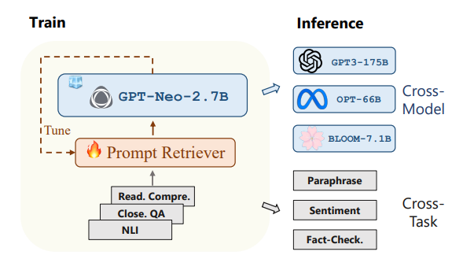

# UPRISE: Universal Prompt Retrieval for Improving Zero-Shot Evaluation

## 工作原理
这篇也是微软研究院发的文章，在23年3月份挂上arxiv，主要探究了训练一个普适的prompt检索器，适用于zero-shot learning，另一篇文章*Learning to Retrieve In-Context Examples for Large Language Models*可以认为是在这篇文章的基础上做出创新，使本篇文章的工作原理可以被使用在few-shot learning（in-context learning）上。

文章的“universal”，指的是两个方面的“普适的”，一是指跨任务，即检索器在一些任务上训练，之后在另一些未见过的任务上检索可用prompt，性能依旧达到要求；二是指跨平台，即检索器在一个较小的模型的“监督”下训练，之后应用在大模型的任务上。具体可见下图：

### 问题定义
给定了一个问题输入$x$，我们需要在一个已定义好的prompt池$P$中检索出一组正面的prompt$P^+$，即：
$$
P^+=R(x,P),
$$
之后将选出的prompt与问题$x$连接，送至固定参数的大模型中，获得预测输出：
$$
y^{P^+}=LLM(y^{P^+} \mid P^+ \bigoplus x),
$$
研究的目标就是通过调整检索器$R$使用更好的prompt，从而使模型的输出$y^{P^+}$尽可能地契合正确答案$y$。
